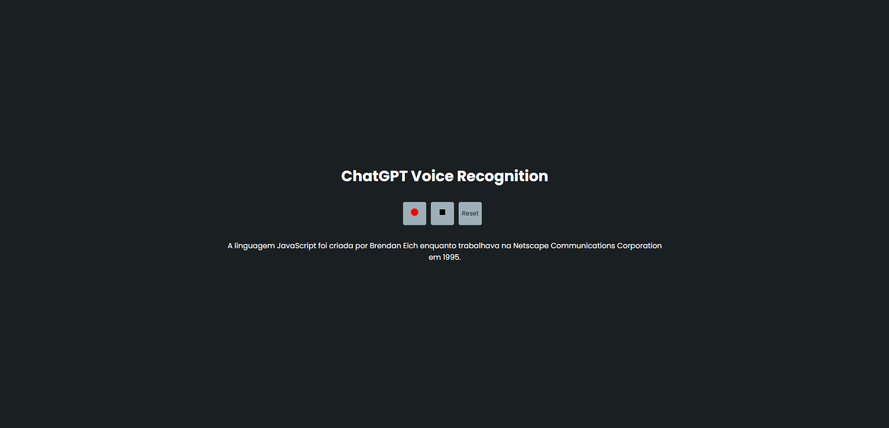

<h1 align="center">
  ChatGPT Voice Recognition
</h1>

  
  
  

  

  

  
  
  

  <a href="#project">Project</a>&nbsp;&nbsp;&nbsp;|&nbsp;&nbsp;&nbsp;
  <a href="#how-it-works">How it works</a>&nbsp;&nbsp;&nbsp;|&nbsp;&nbsp;&nbsp;
  <a href="#technology">Technology</a>&nbsp;&nbsp;&nbsp;|&nbsp;&nbsp;&nbsp; 
  <a href="#arrow_forward-how-to-run">How to run</a>&nbsp;&nbsp;&nbsp;|&nbsp;&nbsp;&nbsp; 

 

## 💻 Project

ChatGPT Voice Recognition is a basic project where you speak and GPT will bring to you the answers and speaks too. 

## How it works

Click in the record button to turn on the microfone and stop to turn off.  
When you stop to talk the microphone will automatically stop, but if don't just click in the stop button. 
The reset button will reset everything include the GPT voice and message. 

## Technology

This project was developed with the following technologies:

- [React](reactjs.org)
- [ChatGPT API](https://openai.com/blog/chatgpt)

## :arrow_forward: How to run

- Just create an account in openAI and generate an API KEY. Copy and past in the project in a .env file.
- Open your terminal and start the project with yarn start or npm run start.

---

Made By ♥ [Elian Campos](https://github.com/lyandeveloper). Add me on [LinkedIn](https://www.linkedin.com/in/elian-campos/) :wave:
